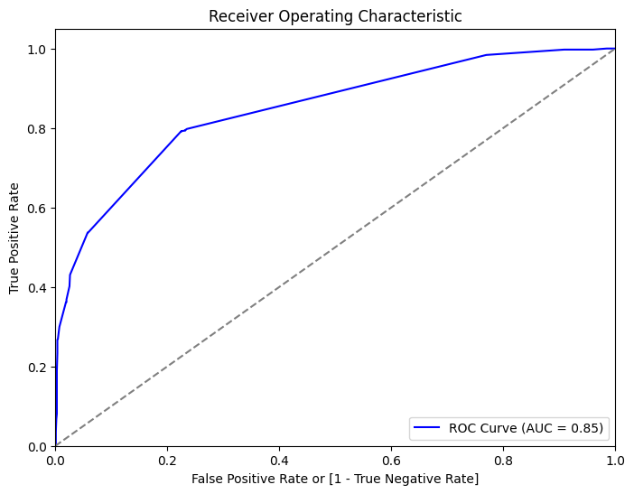
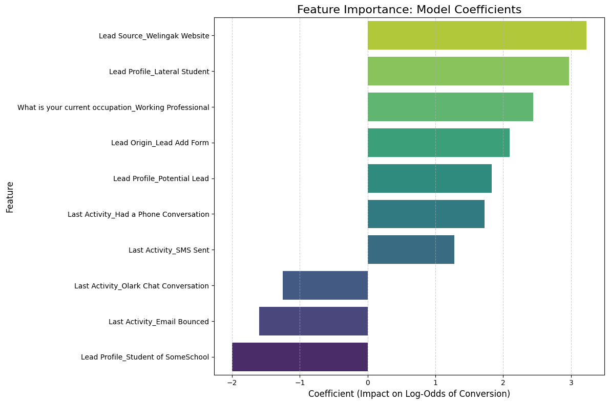

# Lead Conversion Predictive Modeling for X Education

## Project Overview

This project aims to develop a predictive model to identify high-potential leads ("Hot Leads") and improve the lead conversion rate for X Education, an online education company. The primary objective is to build a robust logistic regression model that can assign a **Lead Score (0-100)** to each lead based on their likelihood of conversion. By focusing sales efforts on the most promising leads, the company aims to increase its conversion rate and optimize resource allocation.

## Repository Contents

This repository contains the following files:

1.  **Jupyter Notebook (lead_scoring_case_study.ipynb)**: This notebook includes the complete process of data preprocessing, exploratory data analysis (EDA), feature selection, and logistic regression model development.
2.  **Project Summary (Project_Summary.pdf)**: A document providing a 500-word summary of the project, including the methodology, key findings, and recommendations.
3.  **Presentation Slides (Presentation.pdf)**: A presentation summarizing the project, analysis, and key takeaways for stakeholders.
4.  **README.md**: This file, which provides an overview of the project and the contents of the repository.

 

## Feature Selection & Model Stability

To build a robust and interpretable model, Recursive Feature Elimination (RFE) was used to select the 12 most impactful features. A crucial step after selection is to check for multicollinearity, where predictor variables are highly correlated. This is important because high correlation can make the model unstable.

The heatmap below shows the correlation between the final features used in the model.

As the heatmap illustrates, the correlations between the features are very low (most values are close to 0). This lack of significant multicollinearity confirms that our model is stable and that the impact of each feature on the lead score is being measured independently and reliably.

 

## Model Performance on Test Data

The final logistic regression model demonstrates strong predictive power and reliability on unseen data.

-   **Accuracy**: 78.2%
-   **AUC Score**: 0.85
-   **Sensitivity (Recall)**: 79.2% (Successfully identifies 79.2% of "Hot Leads")
-   **Specificity**: 77.5%

 

_The ROC curve for the test set shows an AUC of 0.85, confirming the model's excellent ability to distinguish between converting and non-converting leads._

 

## Key Findings

Our analysis identified several key factors that significantly influence the probability of a lead converting.

#### Top Indicators of a **Hot Lead** (High Conversion Probability):

1.  **Lead Source & Profile**: The top predictors are leads from the `Welingak Website` (coefficient: 3.23) and those profiled as a `Lateral Student` (coefficient: 2.97). These represent the most valuable lead segments.
2.  **Occupation**: `Working Professionals` represent another key high-conversion demographic, driven by a strong positive model coefficient (2.44).
3.  **Engagement Activity**: A lead who has `Had a Phone Conversation` (coef: 1.72) or received an `SMS` (coef: 1.28) shows a significantly higher likelihood of converting.

#### Top Indicators of a **Cold Lead** (Low Conversion Probability):

1.  **Lead Profile**: Leads profiled as `Student of SomeSchool` are highly unlikely to convert, showing the strongest negative correlation in the model (-2.00).
2.  **Engagement Activity**: Leads whose last activity was an `Olark Chat Conversation` (coef: -1.25) or whose email has `Bounced` (coef: -1.60) have a much lower conversion probability.
3.  **User Behavior**: While not in the final model, EDA revealed that `Total Time Spent on Website` is a critical indicator of a lead's interest level and intent.

## Recommendations

Based on the model and findings, the following actions are recommended to improve the lead conversion rate:

1.  **Implement the Lead Scoring Model**:
    *   Deploy the model to assign a **Lead Score** to all incoming leads.
    *   Direct the sales team to prioritize leads with scores **above 60-70** to focus their efforts on high-potential conversions and maximize efficiency.

2.  **Optimize Marketing and Acquisition Spend**:
    *   Allocate more budget and strengthen partnerships related to the `Welingak Website` as it is the highest-performing lead source.
    *   Investigate the `Lateral Student` profile to understand their acquisition channels and create targeted campaigns to attract more of these high-value leads.
    *   Continue to create marketing campaigns aimed at `Working Professionals`, as they are a core converting demographic.

3.  **Refine Lead Nurturing and Communication**:
    *   Use `SMS` and direct phone calls as primary tools for engaging with high-scoring leads, as these activities are strong indicators of conversion.
    *   Investigate the `Olark Chat` process to understand why it correlates with low conversion. Use findings to retrain agents or improve chat scripts.
    *   Automatically deprioritize or flag leads with `Bounced` emails to prevent the sales team from wasting time on unreachable contacts.

4.  **Improve Data Collection**:
    *   Make critical fields like `Specialization` and `What is your current occupation` mandatory on web forms to enrich the dataset and allow for even better model performance in the future.

For more details, please refer to the accompanying documents in this repository.